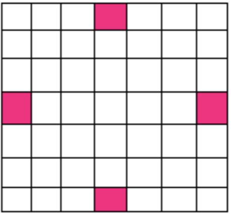

# Progetto Programmazione I - Parthenope
## Auto scontro

Si supponga di avere quattro macchine al centro dei quattro lati opposti di una griglia (vedi figura).Le macchine possono muoversi in una delle quattro posizioni vicine.La griglia è formatada mura esterne ed è di 8x8 caselle.

Si supponga che ogni macchina si muova seguendo le seguenti regole:

* La macchina 1 può andare a destra con probabilità 20% a sinistra con probabilità del 10% in avanti con probabilità del 30% e indietro con probabilità del 40%
* La macchina 2 può andare a destra con probabilità 40% a sinistra con probabilità del 10% in avanti con probabilità del 15% e indietro con probabilità del 35%
* La macchina 3 può andare a destra con probabilità 30% a sinistra con probabilità del 20% in avanti con probabilità del 5% e indietro con probabilità del 45%
* La macchina 4 può andare a destra con probabilità 20% a sinistra con probabilità del 30% in avanti con probabilità del 25% e indietro con probabilità del 25%

La simulazione finisce quando si verifica uno scontro tra almeno due macchine.L'algoritmo usa la function rand() instdlib per generare numeri casuali: si ricorda che per esempio, se numero_casuale è un int, la chiamata numero_casuale=rand()%11 genera un numero casuale intero(distribuzione uniforme) nell'insieme (0,1,2,3,4,5,6,7,8,9,10). Usare sempre la srand() per rendere automatica la scelta iniziale del seed della sequenza di numeri casuali.

###### Effettuare almeno 5 simulazioni

Fornire anche: 
* un insieme di commenti iniziali che spiega brevemente la finalità del programma
* un insieme di commenti all'inizio di ogni function che spiega le finalità della function e il significato dei parametri di input output ( specifiche della function )
* commenti esplicativi dei principali blocchi di istruzioni